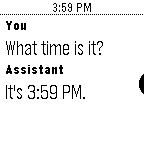

# Clawd (formerly Bobby Assistant)

Clawd is an LLM-based assistant that runs on your Pebble smartwatch,
communicating directly with [OpenClaw](https://github.com/jmsunseri/openclaw) via Telegram.



## Architecture

Clawd runs entirely client-side - no backend server required. The phone app
communicates directly with Telegram using MTProto, sending messages to your
OpenClaw bot instance.

**Flow:**
```
Watch App → Phone App (pkjs) → Telegram MTProto → OpenClaw Bot
```

This eliminates infrastructure costs and allows users to use their self-hosted
OpenClaw instances behind home firewalls.

## Features

- Direct Telegram communication via GramJS (MTProto)
- Tools execute locally on the phone:
  - Alarms and timers
  - Reminders
  - Time zone lookups
- Session stored in localStorage
- No backend required

## Setup

### 1. OpenClaw Setup

1. Install [OpenClaw](https://github.com/jmsunseri/openclaw) on your server
2. Enable the 'llm-task' plugin in OpenClaw
3. Create a skill named 'llm-task' for tools (timers, alarms, etc.) to work
4. Note your OpenClaw bot username (e.g., `@MyOpenClawBot`)

### 2. Telegram API Credentials

You can use shared API credentials (built into the app) or get your own from
[my.telegram.org](https://my.telegram.org):

1. Log in with your phone number
2. Go to "API development tools"
3. Create a new application
4. Note your `api_id` and `api_hash`

### 3. Building the App

1. Install the [Pebble SDK](https://developer.rebble.io/developer.pebble.com/sdk/index.html)
2. Clone this repository
3. Build: `pebble build`
4. Install: `pebble install`

### 4. Configuration

1. Open the Clawd settings on your phone
2. Enter your Telegram phone number (international format, e.g., `+1234567890`)
3. Click "Send Code" to receive a verification code via Telegram
4. Enter the code and click "Sign In"
5. Enter your OpenClaw bot username (e.g., `@MyOpenClawBot`)
6. Save settings

## Development

### Project Structure

```
src/
├── c/                 # Watch app C code
├── pkjs/              # Phone app JavaScript
│   ├── telegram/      # Telegram MTProto client
│   ├── tools/         # Tool definitions and execution
│   ├── actions/       # Action handlers (alarms, reminders)
│   └── session.js     # Main session management
resources/             # Watch app resources (icons, images, etc.)
package.json           # Pebble app configuration
```

### Key Files

- `src/pkjs/telegram/` - GramJS-based Telegram client
- `src/pkjs/tools/` - OpenAI-format tool definitions and local execution
- `src/pkjs/session.js` - Session management and OpenClaw communication
- `src/pkjs/config.json` - Settings UI configuration

## Tool Execution

Tools execute locally on the phone app:

| Tool | Description |
|------|-------------|
| `set_alarm` | Set an alarm on the watch |
| `get_alarms` | List alarms |
| `delete_alarm` | Delete an alarm |
| `set_timer` | Set a timer |
| `get_timers` | List timers |
| `delete_timer` | Delete a timer |
| `set_reminder` | Set a reminder (timeline pin) |
| `get_reminders` | List reminders |
| `delete_reminder` | Delete a reminder |
| `get_time_elsewhere` | Get time in another timezone |

## Security Considerations

- Telegram session is stored in localStorage (consider encryption for production)
- Shared API credentials carry risk of abuse - consider using your own
- Phone numbers are used only during authentication, not stored

## Contributing

See [`CONTRIBUTING.md`](CONTRIBUTING.md) for details.

## License

Apache 2.0; see [`LICENSE`](LICENSE) for details.

## Disclaimer

This project is not an official Google project. It is not supported by
Google and Google specifically disclaims all warranties as to its quality,
merchantability, or fitness for a particular purpose.